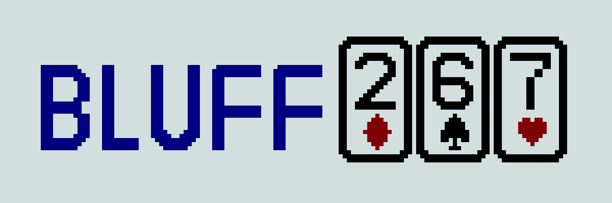
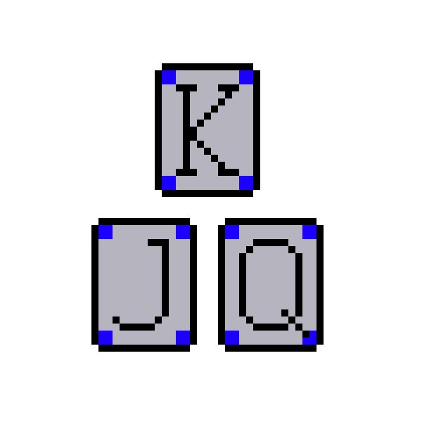
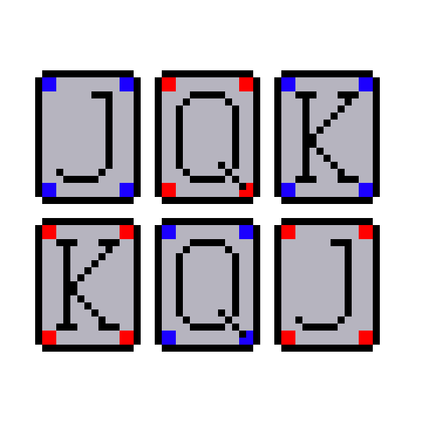
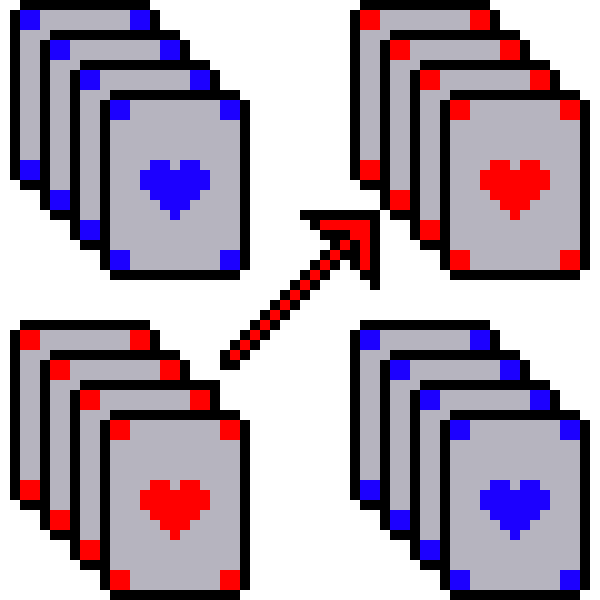
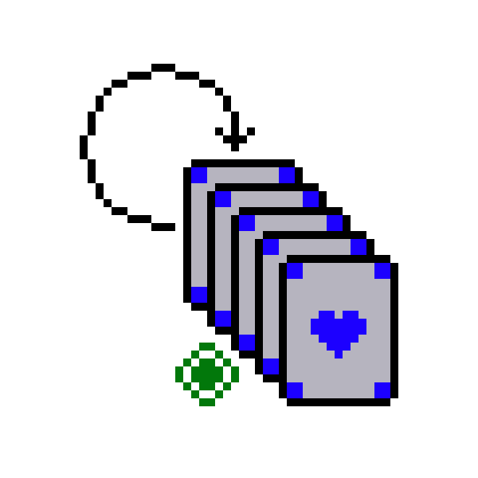
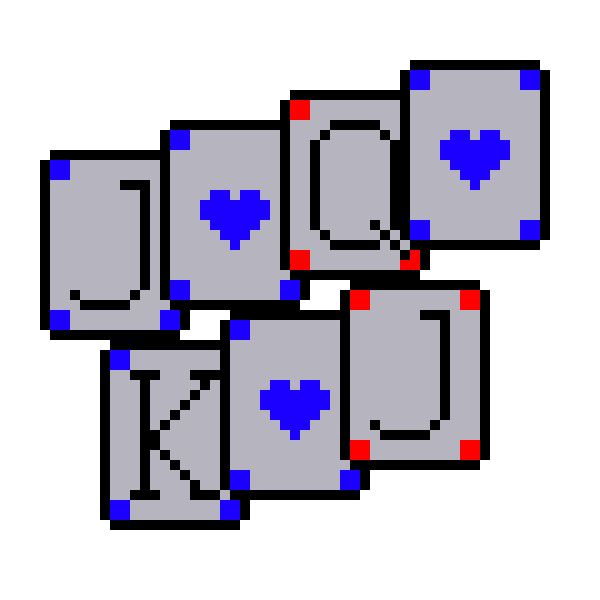
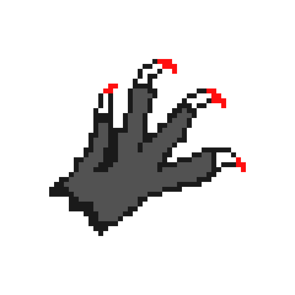

# BluffJAX


<p align="center">
  
  <br/>
</p>

**BluffJAX**: High-speed adversarial imperfect information game environments in JAX for reinforcement learning research.

### Environment Previews

<table align="center">
<tr>
  <td align="center"><br/><em>Kuhn Poker</em></td>
  <td align="center"><br/><em>Leduc Hold'em</em></td>
  <td align="center"><br/><em>Goofspiel</em></td>
  <td align="center"><br/><em>Kemps</em></td>
  <td align="center"><br/><em>Bluff</em></td>
</tr>
<tr>
  <td align="center"><br/><em>5-Card Draw</em></td>
  <td align="center"><br/><em>7-Card Stud</em></td>
  <td align="center"><br/><em>Texas Limit Hold'em</em></td>
  <td align="center"><br/><em>Texas No-Limit Hold'em</em></td>
  <td align="center"><br/><em>Werewolf</em></td>
</tr>
</table>

## Environment Types

- **AEC (Agent-Environment-Cycle)**: Turn-based; `obs` and `action` are for the current player only. Used by Kuhn, Leduc, Bluff, poker variants, Werewolf.
- **Parallel**: Simultaneous moves; `obs` and `action` have shape `(num_agents, ...)`. Used by Goofspiel, Kemps.

## Installation

Inside the directory with pyproject.toml:

```bash
pip install -e .
```

## Requirements
python >= 3.12

distrax==0.1.7 
jax==0.7.2
jaxtyping==0.3.5
optax==0.2.6
flax==0.12.0
omegaconf==2.3.0

To test bluffjax in a new conda environment with the required libraries:

```bash
conda env create -f env.yml
conda activate bluffjax
pip install -e .
```

## Quick Start

```python
import jax
import jax.numpy as jnp
from bluffjax import make, available_envs

# List available environments
print(available_envs())

# Create an environment
env = make("kuhn_poker")  # or "leduc_holdem", "goofspiel", "bluff", etc.

# With custom kwargs
env = make("leduc_holdem", num_agents=2, horizon=100)

# Reset and run random rollouts
key = jax.random.PRNGKey(0)
state, obs = env.reset(key)

def random_rollout(key, env, max_steps=100):
    def step(carry, _):
        key, state, obs = carry
        avail = env.get_avail_actions(state)
        logits = jnp.where(avail, 0.0, -1e9)
        key, k = jax.random.split(key)
        action = jax.random.categorical(k, logits)
        key, k2 = jax.random.split(key)
        state, obs, reward, absorbing, done, info = env.step(k2, state, action)
        return (key, state, obs), (state, obs, reward, done)

    (_, _, _), (states, obs, rewards, dones) = jax.lax.scan(
        step, (key, state, obs), None, length=max_steps
    )
    return states, obs, rewards, dones

states, obs, rewards, dones = random_rollout(key, env)
```

## Available Environments

| ID | Description |
|----|-------------|
| `kuhn_poker` | Kuhn Poker (2-player, 3-card deck) |
| `leduc_holdem` | Leduc Hold'em (2-player, 6-card deck) |
| `goofspiel` | Goofspiel / Game of Pure Strategy |
| `kemps` | Kemps (4-player partnership) |
| `bluff` | Bluff / Cheat card game |
| `five_card_draw` | 5-Card Draw poker |
| `seven_card_stud` | 7-Card Stud poker |
| `texas_limit_holdem` | Texas Limit Hold'em |
| `texas_nolimit_holdem` | Texas No-Limit Hold'em |
| `werewolf` | Werewolf (Mafia) social deduction |


